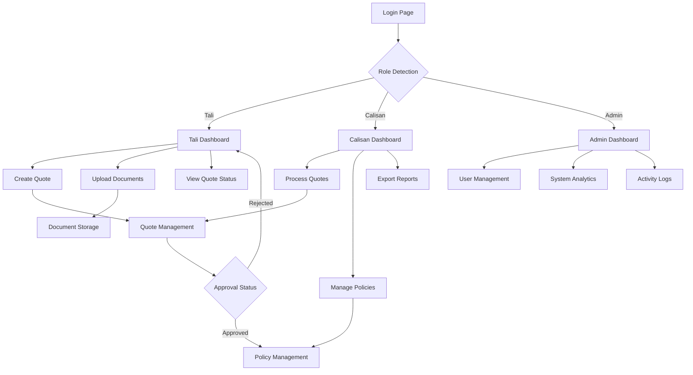

## 1. Product Overview

Sigorta is a comprehensive insurance management system designed to streamline quote creation, policy management, and document handling for insurance companies. The platform serves three distinct user roles - agents (Tali), employees (Calisan), and administrators - with role-specific dashboards and functionality.

The system solves the problem of manual insurance quote processing by providing automated workflows, secure document management with auto-deletion, and comprehensive activity tracking. It helps insurance professionals manage their daily operations efficiently while maintaining data security and compliance.

## 2. Core Features

### 2.1 User Roles

| Role | Registration Method | Core Permissions |
|------|---------------------|------------------|
| Tali (Agent) | Admin invitation + email verification | Create quotes, upload documents, view own quotes, receive notifications |
| Calisan (Employee) | Admin invitation + email verification | Process quotes, manage policies, view all quotes, generate reports |
| Admin | Direct registration | Full system access, user management, system configuration, view all activities |

### 2.2 Feature Module

Our insurance management system consists of the following main pages:

1. **Login page**: User authentication, role-based redirect, password reset.
2. **Tali Dashboard**: Mobile-first interface for quote creation, document upload, quote status tracking.
3. **Calisan Dashboard**: Quote processing interface, policy management, Excel export functionality.
4. **Admin Dashboard**: User management, system analytics, activity logs monitoring.
5. **Quote Management**: Quote creation form, document attachment, status updates.
6. **Policy Management**: Policy creation from quotes, policy tracking, document storage.

### 2.3 Page Details

| Page Name | Module Name | Feature description |
|-----------|-------------|---------------------|
| Login | Authentication | Validate user credentials, implement role-based redirects, provide password reset functionality, maintain session management. |
| Tali Dashboard | Quick Actions | Create new quote button, upload document button, view recent quotes, access quote history, mobile-optimized interface. |
| Tali Dashboard | Quote List | Display user's quotes with status indicators, filter by date/status, search functionality, pagination (50 items per page). |
| Tali Dashboard | Document Upload | Drag-and-drop file upload, support for images/PDFs, automatic compression to 500KB max, real-time upload progress. |
| Calisan Dashboard | Quote Queue | View all pending quotes, filter by agent/date/product, process quotes with approval/rejection, add internal notes. |
| Calisan Dashboard | Policy Management | Convert approved quotes to policies, generate policy documents, track policy lifecycle, update policy status. |
| Calisan Dashboard | Export Tools | Export quote data to Excel format, select date ranges, choose export columns, download reports. |
| Admin Dashboard | User Management | Invite new users, assign roles, deactivate accounts, view user activity, manage permissions. |
| Admin Dashboard | System Analytics | View quote volumes, conversion rates, user activity metrics, generate performance reports. |
| Admin Dashboard | Activity Logs | Monitor all system activities, filter by user/action/date, export logs, investigate suspicious activities. |
| Quote Management | Quote Form | Input customer details, select insurance product, calculate premiums, add coverage details, save draft functionality. |
| Policy Management | Policy Details | View complete policy information, download policy documents, track payment status, handle renewals. |

## 3. Core Process

### Tali (Agent) Flow
The agent starts by logging into the mobile-first dashboard. They can create new quotes by filling out customer information and selecting insurance products. After quote creation, they upload required documents which are automatically compressed and stored. The agent can track quote status in real-time and receives notifications when quotes are processed.

### Calisan (Employee) Flow
Employees access their dashboard to view pending quotes from agents. They review quote details and attached documents, then either approve or reject quotes with comments. Approved quotes are converted to policies with generated policy documents. Employees can export quote data to Excel for reporting and analysis.

### Admin Flow
Administrators manage the entire system through their dashboard. They invite new users, assign appropriate roles, and monitor system-wide activities. Admins can view analytics, manage system settings, and investigate any suspicious activities through detailed logs.

## 4. User Interface Design

### 4.1 Design Style

- **Primary Colors**: Deep blue (#1e40af) for primary actions, emerald (#10b981) for success states
- **Secondary Colors**: Gray scale for neutral elements, red (#ef4444) for errors/warnings
- **Button Style**: Rounded corners (8px radius), subtle shadows, clear hover states
- **Typography**: Inter font family, 16px base size, clear hierarchy with appropriate weights
- **Layout**: Card-based design with consistent spacing, mobile-first responsive approach
- **Icons**: Feather icons for consistency, clear visual metaphors for actions

### 4.2 Page Design Overview

| Page Name | Module Name | UI Elements |
|-----------|-------------|-------------|
| Login | Form Section | Centered card layout, company logo, email/password inputs with icons, primary login button, password reset link, responsive for mobile. |
| Tali Dashboard | Header | Sticky navigation with user menu, notification bell with badge, quick action buttons with icons, mobile hamburger menu. |
| Tali Dashboard | Quote Cards | Horizontal scrolling cards on mobile, grid layout on desktop, status badges with colors, action buttons on each card, loading skeletons. |
| Calisan Dashboard | Data Table | Sortable columns, row hover effects, status indicators, action dropdown menu, pagination controls, search/filter bar. |
| Admin Dashboard | Analytics Cards | KPI cards with large numbers, trend indicators, chart.js graphs, responsive grid layout, export buttons. |
| Document Upload | Drop Zone | Dashed border drag area, file type icons, upload progress bar, success/error messages, file preview thumbnails. |

### 4.3 Responsiveness

The system follows a mobile-first design approach. Tali dashboard is specifically optimized for mobile devices with touch-friendly interfaces, larger tap targets, and swipe gestures. Calisan and Admin dashboards are desktop-first but fully responsive, adapting from desktop to tablet to mobile breakpoints. All interactive elements maintain minimum 44px touch targets for accessibility.

### 4.4 3D Scene Guidance

Not applicable for this insurance management system.