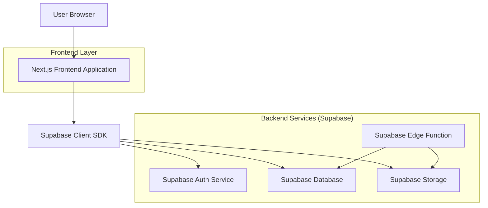
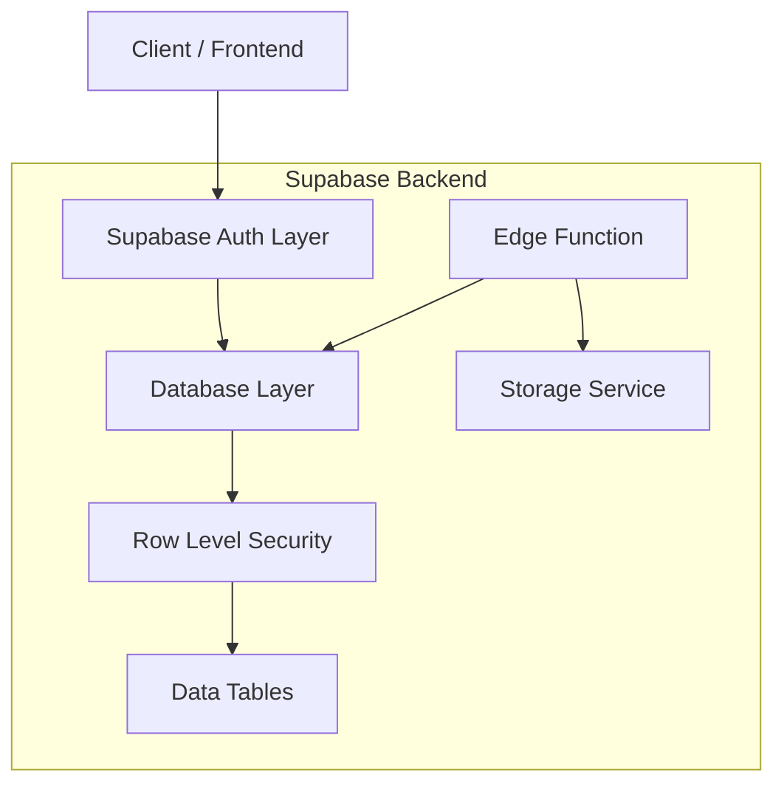
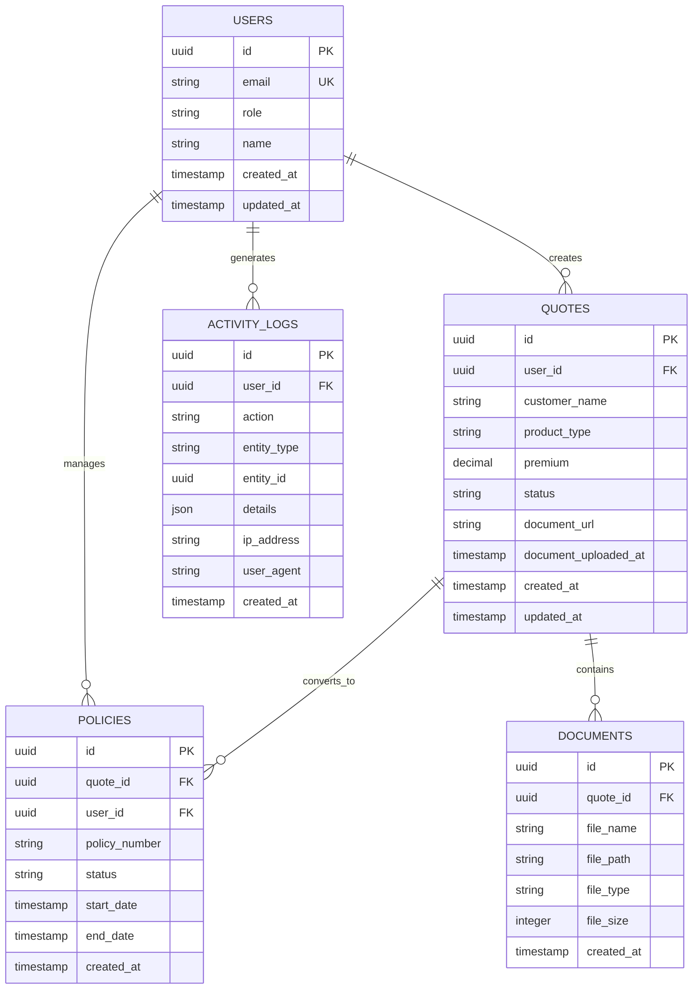

## 1. Architecture design



## 2. Technology Description

- Frontend: Next.js@14 + TypeScript@5 + Tailwind CSS@3
- Initialization Tool: create-next-app
- Backend: Supabase (Auth, Database, Storage, Edge Functions)
- Additional Libraries: 
  - @supabase/supabase-js@2 (Supabase client)
  - react-query@5 (Data fetching and caching)
  - lucide-react@0.294 (Icons)
  - xlsx@0.18 (Excel export functionality)
  - zod@3 (Schema validation)

## 3. Route definitions

| Route | Purpose |
|-------|---------|
| /login | Authentication page for all user roles |
| /dashboard/tali | Mobile-first dashboard for agents |
| /dashboard/calisan | Employee dashboard for quote processing |
| /dashboard/admin | Administrative dashboard for system management |
| /quotes/create | Quote creation form |
| /quotes/[id] | Individual quote details and management |
| /policies | Policy management interface |
| /documents | Document upload and management |
| /reports | Excel export and reporting tools |
| /settings | User settings and profile management |

## 4. API definitions

### 4.1 Authentication APIs

```
POST /auth/v1/token
```

Request:
| Param Name | Param Type | isRequired | Description |
|------------|------------|------------|-------------|
| email | string | true | User email address |
| password | string | true | User password |

Response:
| Param Name | Param Type | Description |
|------------|------------|-------------|
| access_token | string | JWT token for API access |
| refresh_token | string | Token for refreshing access |
| user | object | User profile information |

### 4.2 Quote Management APIs

```
GET /rest/v1/quotes
```

Query Parameters:
| Param Name | Param Type | isRequired | Description |
|------------|------------|------------|-------------|
| user_id | string | false | Filter by user ID |
| status | string | false | Filter by quote status |
| limit | number | false | Pagination limit (max 50) |
| offset | number | false | Pagination offset |

### 4.3 Document Upload APIs

```
POST /storage/v1/object/documents
```

Request Headers:
| Header Name | Value |
|-------------|--------|
| Authorization | Bearer {access_token} |
| Content-Type | multipart/form-data |

## 5. Server architecture diagram



## 6. Data model

### 6.1 Data model definition



### 6.2 Data Definition Language

Users Table (users)
```sql
-- create table
CREATE TABLE users (
  id UUID PRIMARY KEY DEFAULT gen_random_uuid(),
  email VARCHAR(255) UNIQUE NOT NULL,
  role VARCHAR(20) NOT NULL CHECK (role IN ('tali', 'calisan', 'admin')),
  name VARCHAR(100) NOT NULL,
  created_at TIMESTAMP WITH TIME ZONE DEFAULT NOW(),
  updated_at TIMESTAMP WITH TIME ZONE DEFAULT NOW()
);

-- create index
CREATE INDEX idx_users_email ON users(email);
CREATE INDEX idx_users_role ON users(role);
```

Quotes Table (quotes)
```sql
-- create table
CREATE TABLE quotes (
  id UUID PRIMARY KEY DEFAULT gen_random_uuid(),
  user_id UUID REFERENCES users(id) ON DELETE CASCADE,
  full_name VARCHAR(255) NOT NULL, -- AD SOYAD
  birth_date DATE, -- DOĞUM TARİHİ
  company VARCHAR(100), -- ŞİRKET
  date TIMESTAMP WITH TIME ZONE DEFAULT NOW(), -- TARİH
  chassis_number VARCHAR(100), -- ŞASİ
  plate_number VARCHAR(20), -- PLAKA
  identity_number VARCHAR(20), -- TC/VKN
  document_number VARCHAR(50), -- BELGE NO
  vehicle_type VARCHAR(50), -- ARAÇ CİNSİ
  gross_premium DECIMAL(10,2), -- BRÜT PRİM
  type VARCHAR(50), -- TÜR
  issuer VARCHAR(100), -- KESEN
  related_person VARCHAR(100), -- İLGİLİ KİŞİ
  policy_number VARCHAR(50), -- POLİÇE NO (Null for quotes, filled for policies)
  agency VARCHAR(100), -- ACENTE
  card_info TEXT, -- KART
  additional_info TEXT, -- EK BİLGİLER / İLETİŞİM
  net_premium DECIMAL(10,2), -- NET PRİM
  commission DECIMAL(10,2), -- KOMİSYON
  status VARCHAR(20) DEFAULT 'pending' CHECK (status IN ('pending', 'approved', 'rejected')),
  document_url TEXT,
  document_uploaded_at TIMESTAMP WITH TIME ZONE,
  created_at TIMESTAMP WITH TIME ZONE DEFAULT NOW(),
  updated_at TIMESTAMP WITH TIME ZONE DEFAULT NOW()
);

-- create index
CREATE INDEX idx_quotes_user_id ON quotes(user_id);
CREATE INDEX idx_quotes_status ON quotes(status);
CREATE INDEX idx_quotes_created_at ON quotes(created_at DESC);
```

Policies Table (policies)
```sql
-- create table
CREATE TABLE policies (
  id UUID PRIMARY KEY DEFAULT gen_random_uuid(),
  quote_id UUID REFERENCES quotes(id) ON DELETE CASCADE,
  user_id UUID REFERENCES users(id) ON DELETE CASCADE,
  policy_number VARCHAR(50) UNIQUE NOT NULL,
  status VARCHAR(20) DEFAULT 'active' CHECK (status IN ('active', 'expired', 'cancelled')),
  start_date DATE NOT NULL,
  end_date DATE NOT NULL,
  created_at TIMESTAMP WITH TIME ZONE DEFAULT NOW()
);

-- create index
CREATE INDEX idx_policies_quote_id ON policies(quote_id);
CREATE INDEX idx_policies_user_id ON policies(user_id);
CREATE INDEX idx_policies_status ON policies(status);
```

Activity Logs Table (activity_logs)
```sql
-- create table
CREATE TABLE activity_logs (
  id UUID PRIMARY KEY DEFAULT gen_random_uuid(),
  user_id UUID REFERENCES users(id) ON DELETE CASCADE,
  action VARCHAR(100) NOT NULL,
  entity_type VARCHAR(50),
  entity_id UUID,
  details JSONB,
  ip_address INET,
  user_agent TEXT,
  created_at TIMESTAMP WITH TIME ZONE DEFAULT NOW()
);

-- create index
CREATE INDEX idx_activity_logs_user_id ON activity_logs(user_id);
CREATE INDEX idx_activity_logs_action ON activity_logs(action);
CREATE INDEX idx_activity_logs_created_at ON activity_logs(created_at DESC);
```

### 6.3 Row Level Security Policies

```sql
-- Grant basic read access to anon role
GRANT SELECT ON quotes TO anon;
GRANT SELECT ON policies TO anon;

-- Grant full access to authenticated role
GRANT ALL PRIVILEGES ON quotes TO authenticated;
GRANT ALL PRIVILEGES ON policies TO authenticated;
GRANT ALL PRIVILEGES ON activity_logs TO authenticated;

-- RLS Policy: Users can only see their own quotes (unless admin)
CREATE POLICY "Users can view own quotes" ON quotes
  FOR SELECT USING (
    auth.uid() = user_id OR 
    EXISTS (
      SELECT 1 FROM users 
      WHERE id = auth.uid() AND role = 'admin'
    )
  );

-- RLS Policy: Users can only see their own policies (unless admin)
CREATE POLICY "Users can view own policies" ON policies
  FOR SELECT USING (
    auth.uid() = user_id OR 
    EXISTS (
      SELECT 1 FROM users 
      WHERE id = auth.uid() AND role = 'admin'
    )
  );
```

### 6.4 Supabase Edge Function Reference

The auto-delete function runs hourly via cron job (0 * * * *) to clean up old documents:

```typescript
// supabase/functions/auto-delete-documents/index.ts
Deno.serve(async (req) => {
  const { data: policies } = await supabase
    .from('policies')
    .select('quote_id')
    .lt('created_at', new Date(Date.now() - 60 * 60 * 1000)); // 1 hour ago
  
  for (const policy of policies) {
    // Delete document URL from quotes
    await supabase
      .from('quotes')
      .update({ document_url: null, document_uploaded_at: null })
      .eq('id', policy.quote_id);
    
    // Delete from storage
    await supabase.storage
      .from('documents')
      .remove([`${policy.quote_id}/ruhsat.jpg`]);
  }
  
  return new Response('OK');
});
```

### 6.5 Excel Export Implementation

```typescript
import * as XLSX from 'xlsx';

export function exportToExcel(data: any[], filename: string) {
  const worksheet = XLSX.utils.json_to_sheet(data);
  const workbook = XLSX.utils.book_new();
  XLSX.utils.book_append_sheet(workbook, worksheet, 'Data');
  
  // Auto-size columns
  const maxWidth = data.reduce((w, r) => Math.max(w, r.length), 10);
  worksheet['!cols'] = [{ wch: maxWidth }];
  
  XLSX.writeFile(workbook, `${filename}.xlsx`);
}

// Usage in React component
<Button onClick={() => exportToExcel(quotes, 'teklifler')}>
  Excel'e Aktar
</Button>
```

### 6.6 Activity Logging Implementation

```typescript
export async function logActivity(
  action: string,
  entityType?: string,
  entityId?: string,
  details?: any
) {
  await supabase.from('activity_logs').insert({
    user_id: currentUser.id,
    action,
    entity_type: entityType,
    entity_id: entityId,
    details,
    ip_address: await getIpAddress(),
    user_agent: navigator.userAgent,
  });
}

// Usage
await logActivity('quote_created', 'quote', quote.id, { product: 'Kasko' });
```